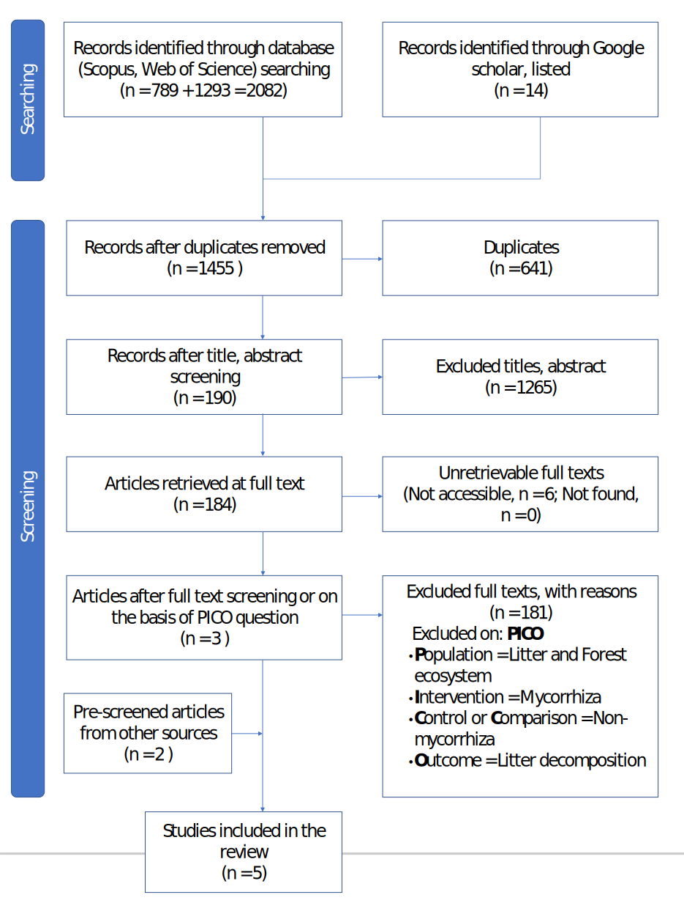

> This is the original draft that has not been peer-reviewed yet.

```{r setup, include=FALSE}
## global chunk options
knitr::opts_chunk$set(echo = FALSE, comment = "#>",
                      dev = "svglite",
                      fig.align = "center",
                      warning = FALSE, message = FALSE)

## directory path to save figures
mypath <- "C:/Users/ARVIND/Desktop/Lab_Work/Meenu_Patil/Mycorrhiza/figures"

## packages
library(ggtree)
library(metafor)
library(tidyverse)
```

## Abstract

The presence of mycorrhiza can either increase or decrease the litter decomposition rates either by facilitation or competition. However, empirical evidence about the magnitude and direction of such effects remained unclear. We conducted a formal meta-analysis of published peer-reviewed literature to address this knowledge gap. Surprisingly, a systematic literature search with pre-defined inclusion criteria identified only five comparable studies. Therefore, based on 14 estimates from these studies, we evaluated the effects of mycorrhizal association on litter decomposition rates for nine species. Our meta-analysis with random-effect model showed strong evidence (RR = 1.07, *Z* = 3.58, *p* < 0.001) for increased litter decomposition rates in presence of mycorrhizal fungi. The variations in the effects were influenced by species identity, but no effects were observed due to phylogeny. Thus, we found support for the mycorrhizal-mediated acceleration of litter decomposition, which questions the generality of the ‘Gadgil effect.’ Overall our findings suggest that the inclusion of mycorrhizal effects can advance our understanding of nutrient cycling and its responses to global environmental change. However, we need more studies conducted for a longer duration and representative of diverse ecosystems and litter types to arrive at a more robust conclusion.

**Keywords:** gadgil effect; ectomycorrhiza; arbuscular mycorrhiza; forest ecosystem; litter decomposition; meta-analysis

## Introduction

Global environmental change is expected to substantially alter the biogeochemistry and nutrient cycling in terrestrial ecosystems [@Shu2019]. Among terrestrial ecosystems, forest ecosystems acts as significant sink for soil organic matter and therefore, substantially influence the global nutrient cycling [@Pan2011]. The cycling of nutrients is primarily regulated by the process of litter decomposition, which releases nutrients from plant biomass to the soils [@Shu2019; @Patil2020azb]. Much of the variations in the litter decomposition rates are explained by climate and litter quality [@Zhang2008; @Cornwell2008; @Patil2020srep]. However, the remaining proportion of variation is often attributed to the composition and activity of decomposer organisms [@McGuire2010; @Sulman2017]. Among decomposer organisms, bacteria and fungi are two major group organisms involved in litter decomposition [@Schneider2012; @Heijden2015]. Although the role of saprotrophic fungi is appreciated in litter decomposition, mycorrhizal fungi can also substantially influence litter decomposition because they often act as mediators of nutrients between plants and soil [@Finlay2005; @Frey2019; @Kumar2021]. Among the mycorrhizal associations, arbuscular mycorrhizal fungi (AMF) and ectomycorrhizal fungi (EMF) are commonly associated with vascular plants [@Brundrett2018]. While the AMF dominates the tropical forests, EMF associations are frequently observed in extra-tropical forests  [@Steidinger2019]. Thus, the effects of mycorrhizal fungi are expected to vary not only among mycorrhizal groups, but also across the plant species, ecosystems and environmental conditions.

Mycorrhizal fungi have been observed to decrease the litter decomposition rates [@Gadgil1971; @Gadgil1975], which is frequently referred as 'Gadgil effect' in the literature [@Gadgil1971; @Fernandez2016]. The 'Gadgil effect' has been observed for both ectomycorrhizal [@Gadgil1971] and arbuscular mycorrhizal fungi [@Leifheit2015]. The resource competition between saprotrophs (free living microbes) and symbionts (mycorrhizal fungi) have been suggested to retard the decomposition rates in presence of mycorrhizal fungi [@Gadgil1971; @Brzostek2015]. The specialized enzymatic suite and foraging behaviour of these mycorrhizal fungi have been attributed to their ability to outcompete the saprotrophic fungi or other detritivore community [@Averill2014; @Talbot2015]. Further, a literature review [@Fernandez2016] has also ascribed Gadgil effect to nitrogen competition [@Orwin2011; @Averill2014], chemical inhibition or allelopathy [@Krywolap1964; @Rasanayagam1992], myco-parasitism [@Kubicek2011], and altered moisture-regimes [@Koide2003]. 

In contrast to Gadgil effect, mycorrhizal fungi also reported to enhance the litter decomposition rates [@Frey2019] through extracellular enzymatic degradation [@Talbot2015], oxidation via Fenton chemistry [@Beeck2018], and priming effects, i.e., stimulation of growth and activities of saprotrophic decomposers by providing plant-derived carbon sources [@Herman2012; @Gorka2019]. The priming effects appear to be more widespread as mycorrhizal fungi have limited genetic capabilities to produce organic matter degrading enzymes [@Frey2019]. The availability of labile exudates together with mycorrhizal necromass stimulates the activity of free-living bacteria and saprotrophic fungi, which leads to higher decomposition rates [@Fernandez2016]. Further, the the differences in ecophysiology of mycorrhizal groups are expected to modulate their effects on litter decomposition rates [@Tedersoo2019]. For instance, the capacities for enzymatic degradation of organic matter widely vary among mycorrhizal taxa and it appears that EMF taxa have more degrading capacities than the AMF taxa [@Frey2019]. Therefore, considering the type of mycorrhizal association can be important in understanding the role of mycorrhizal fungi in nutrient cycling.

Thus, available literature suggest that mycorrhizal fungi can either enhance the litter decomposition by providing plant-derived carbon-source [@Zhu1996; @Shah2016; @Gui2017; @Sterkenburg2018] or suppress it by competing for the same resources with saprotrophic fungi, also known as 'Gadgil effect' [@Gadgil1971; @Gadgil1975; @Brzostek2015]. Nevertheless, some studies found little or no effects of mycorrhizal association on litter decomposition [@Staaf1988]. Therefore, the effects of mycorrhizal association on litter decomposition remained equivocal and highly variable in magnitude and direction, suggesting more complex mechanisms and contexts than previously thought [@Fernandez2016]. Although few exemplary syntheses about the effects of mycorrhizal association on litter decomposition exist [@Averill2014; @Fernandez2016], quantitative estimates and direction of such effects remained ambiguous. Further, none of the earlier syntheses conducted a formal meta-analysis and their general conclusions might be confounded by sampling error or other sources of variations. Therefore, our primary objective is to quantitatively synthesise the magnitude and direction of mycorrhizal effects on litter decomposition rates in forest ecosystems. Further, we can expect substantial differences in effect due to species identity and phylogenetic relatedness among them because each species may have different quality of litter which can influence the decomposition rates. In addition to this, we aim to identify the knowledge gaps and suggestions for future investigations. Specifically, we aim to address the following questions:

1. Do mycorrhizal presence affect rates of litter decomposition in forest ecosystems?
2. What is the magnitude and direction of mycorrhizal effects on litter decomposition rates?
3. Are these effects influenced by species or their phylogenetic relatedness?
4. Do these effects differ between angiosperms and gymnosperms?

To accomplish this, we carried out a formal meta-analysis of available data from systematically identified comparable studies. In this meta-analysis, we included a forest plot showing mycorrhiza's overall effect on litter decomposition, between-study heterogeneity, and a funnel plot for showing publication bias of studies. We explored different meta-analytic models and assessed the robustness of our estimates. Then, we discussed the results of all studies briefly. In the end, we draw conclusions of the mycorrhizal effect on litter decomposition based on the results of our meta-analysis. 

## Methodology

Our methodology broadly consisted of five phases, i.e., searching, screening, data extraction, statistical meta-analysis and sensitivity analysis. We followed the guidelines developed by Collaboration on Environmental Evidence [@Pullin2018] to identify eligible studies using a systematic literature search and screening protocol. The protocol was developed by organising meetings and implemented in a similar manner as described earlier [@Kumar2022]. Further, the quality and reproducibility of meta-analysis was ensured by adhering to previously recommended guidelines [@Koricheva2014; @Nakagawa2017].

### Literature search

We systematically searched Scopus (https://scopus.com/) and Web of Science Core Collection (https://webofknowledge.com/) on 17-18 February 2021 with the following search string:

> (mycorrhiza* OR ectomycorrhiza* OR "saprotrophic fungi" OR plant-fung\*) AND (litter OR "litter decay" OR (litter AND decompos\*) OR decomposition OR "nutrient acquisition") AND (forest). 

This search string was developed by combining previously identified groups of keywords (see Supplementary information Table S1). Additionally, Google Scholar (https://scholar.google.com/) was searched on 18-Feb-2021 using "Mycorrhiza decomposition" and "Mycorrhiza nutrient acquisition". Thus, we obtained 789 records from Scopus, 1,293 records from Web of Science Core Collection, and 14 records from Google Scholar. All these 2,096 records were exported as BibTex files for further processing (see details in Supplementary Information). 

```{r eval=FALSE}
library(synthesisr)

bib <- list.files(path = "data/bib/", full.names = TRUE)

refs <- read_refs(filename = bib, return_df = TRUE)

df <- deduplicate(refs, match_by = "title", method = "exact")

duplicate <- find_duplicates(data = df$title, method = "string_osa",
                               to_lower = TRUE, rm_punctuation = TRUE, threshold = 7)

manual_check <- review_duplicates(text = df$title, matches = duplicate)

#print(manual_check)

newduplicates <- override_duplicates(duplicate, 4)

resultsref <- extract_unique_references(df, newduplicates)

#write_refs(x = resultsref, format = "ris", file = "data/bib/uniqueref.ris")
```

### Article screening

Our article screening involved de-duplication, title and abstract screening, and full-text screening. We left 1,455 records after de-duplication, and 641 duplicates were removed (Figure \@ref(fig:fig1)). All these records were imported to freely available Mendeley reference management software for further screening. We manually screened titles and abstracts of each document following a pre-defined criterion (see Supplementary information). Based on the title and abstract screening, we excluded 1,265 articles and left with 190 articles (Figure \@ref(fig:fig1)). We could not retrieve the full-text of six articles (see Supplementary information Table S2) and, therefore, excluded these six articles. Next, the full text of each article was screened based on PICO inclusion and exclusion criteria (Supplementary information Table S3). Full-text screening resulted in the exclusion of 181 articles based on PICO criteria (Figure \@ref(fig:fig1)). Thus, we were finally left with only three eligible studies [@Entry1991; @Zhu1996; @Lang2021].
We further employed snowballing method to identify related eligible studies. We could not identify any suitable related study based on references of selected studies (backward snowballing). However, two more eligible articles [@Mayor2006; @Fernandez2020] were identified through forward snowballing (citation tracking). Thus, five studies were included after article screening and snowballing.

```{r fig1, fig.height=7, fig.cap="Schematic flow diagram for literature search, screening and inclusion process [modified from @Haddaway2018]"}

```

### Data extraction

We needed data on litter decomposition rates in the presence and absence of mycorrhiza to test our hypothesis. The litter decomposition rate is often expressed as annual decay constant usually estimated from Olson's single exponential model [@Olson1963]. Therefore, we aimed to extract the decay constant ($\kappa$) and associated standard error (SE) or standard deviation (SD) for each study to establish consistency in our analysis. Unfortunately, only a single study [@Entry1991] reported the data in required form. All other studies have represented litter decomposition rates as mass remaining at different time intervals [@Zhu1996; @Mayor2006; @Fernandez2020; @Lang2021]. In such cases, we extracted each remaining mass value in triplicate (one mean value and two standard error of mean values) at each given time interval using the WebPlotDigitizer (https://automeris.io/WebPlotDigitizer/). Thus, the actual number of replicates of litterbags at each sampling time was not taken into account; instead, we considered each data point as a sample to obtain a more uniform and comparable measure of litter mass remaining. In case of any ambiguity in timings, we considered the time stated in the methodology section of the published article [@Lang2021].

```{r}
## Data Preparation
#==================

## load raw data
dat_raw <- read.csv("data/mass_remaining.csv", fileEncoding = "UTF-8-BOM")

## convert to longer form and combine mean and se values
## for absence of mycorrhiza
dat_ab <- dat_raw |>
  select(-c(mean_pr, se_pr1, se_pr2)) |>
  pivot_longer(cols = c(mean_ab, se_ab1, se_ab2), 
               names_to = "vars", values_to = "val_ab") |>
  select(-vars) |>
  rowid_to_column()

## for presence of mycorrhiza
dat_pr <- dat_raw |> 
  select(-c(mean_ab, se_ab1, se_ab2)) |>
  pivot_longer(cols = c(mean_pr, se_pr1, se_pr2), 
               names_to = "vars", values_to = "val_pr") |>
  select(-vars) |>
  rowid_to_column()

## combine and add number of samples
dat_long <- dat_ab |>
  left_join(dat_pr) |>
  group_by(id) |>
  mutate(n = n()) |>
  select(-rowid)

## calculation of k and sd
dat <- dat_long |> 
  ## group data
  group_by(id, author, year, species, n) |>
  ## calculate and extract coefficient and se
  summarise(mean_k_ab = abs(summary(lm(log(val_ab)~time))$coefficients[2,1]),
            se_k_ab = summary(lm(log(val_ab)~time))$coefficients[2,2],
            mean_k_pr = abs(summary(lm(log(val_pr)~time))$coefficients[2,1]),
            se_k_pr = summary(lm(log(val_pr)~time))$coefficients[2,2]) |>
  ## convert se to sd
  mutate(sd_k_ab = se_k_ab * sqrt(n),
         sd_k_pr = se_k_pr * sqrt(n)) |>
  ## remove se columns
  select(!starts_with("se"))

## Another study with k and sd (Entry et al 1991)
entry_et_al <- read.csv("data/raw_entry1991.csv") |>
  select(-c(w0_g, t_yr)) |>
  rename("mean_k_pr" = "k_pr", "sd_k_pr" = "sd_pr", 
         "mean_k_ab" = "k_ab", "sd_k_ab" = "sd_ab")

## add entry et al 1991
dat <- dat |> bind_rows(entry_et_al)

## remove files that are no longer needed
rm(dat_raw, dat_ab, dat_pr, dat_long, entry_et_al)
```

When the mass remaining data was available, the decay constant ($\kappa$) and its associated standard error (SE) was estimated by fitting a linearised form of Olson's single exponential decay model [@Olson1963] as represented in Equation \@ref(eq:olson).

$$\begin{equation}
\log(M_t) = -\kappa~t + \log(M_0)
(\#eq:olson)
\end{equation}$$

where $M_0$ is the initial litter mass, $M_t$ is the mass remaining at time $t$, and $\kappa$ is the decay constant. When a study reported data for the same species at different sub-sites [@Fernandez2020] or different seasons [@Entry1991], we estimated or recorded the decay constant ($\kappa$) and its associated standard error (SE) or standard deviation (SD) separately.
In addition to this, we recorded the plant species, mycorrhizal types, forest ecosystem types, litter types, and geographic coordinates of study sites. Further, we also noted technical information about methodologies, including the number of study experiments, duration of the investigation, exclusion method for mycorrhiza, and the characteristics of litter and litter bags.

### Phylogenetic data

To test the influence of phylogenetic relatedness, we used the recently published GBOTB backbone of phylogeny for seed plants, which is based on data from [GenBank](https://www.ncbi.nlm.nih.gov/genbank/) and [Open Tree of Life](https://tree.opentreeoflife.org/opentree/argus/opentree13.4@ott93302) [@Smith2018]. It is considered as the largest dated phylogeny for 79,881 taxa of seed plants resolved at species level. We used the package `V.PhyloMaker` (version `r packageVersion("V.PhyloMaker")`) to prepare a phylogenetic tree for the selected plant species [@Jin2019]. The phylogeny was generated from the `GBOTB.extended` mega-tree, which is a combination of two published phylogenies for plants [@Smith2018; @Zanne2014]. The nodes were built using the `build.nodes.1` function, which returns the most recent common ancestor of all the tips in the largest cluster of the genus, and define it as the basal node of the genus. Further, the phylogeny was generated under the *Scenario 3* for binding of new genus tip to the family branch as defined in earlier study [@Qian2016].

```{r eval=FALSE}
library(V.PhyloMaker)

## species list based on The Plant List
spp <- read.csv("data/species_classification.csv") |> 
  select(species, genus, family)
  
result <- V.PhyloMaker::phylo.maker(
  # formatted species list
  sp.list = spp, 
  ## backbone phylogeny
  tree = V.PhyloMaker::GBOTB.extended, 
  ## genus and family nodes information
  nodes = V.PhyloMaker::nodes.info.1,
  ## phylogenetic hypothesis scenario
  scenarios = "S3")

## save the tree
#ape::write.tree(result$scenario.3, "data/phylo.tre")
```

### Effect size and variance

Various effect sizes are used to summarize the magnitude and direction of the relationship between two variables [@Cooper2009; @Harrer2021]. Among available effect sizes, response ratios (also called as Ratio of Means) and standardised mean differences have been frequently used to compare the means between two groups (i.e., experimental and control) in ecology and evolution [@Nakagawa2012; @Koricheva2014]. The response ratio or ratio of means is recommended when the mean of control group is not very small as compared to experimental group and both groups have estimates of same sign either positive or negative [@Hedges1999; @Lajeunesse2015]. The log transformation of response ratio ($\text{lnRR}$) makes the metric equally sensitive to changes in both numerator and denominator, apart from making the metric nearly normal. Thus, it measures the actual difference in responses scaled to mean in control groups. However, $\text{lnRR}$ is considered to be slightly biased towards null effects and usually estimate high heterogeneity than other effect size measures [@Lajeunesse2015]. 

Since the rate of litter decomposition is influenced by time (i.e., greater weight loss during initial phase than the later phases), we decided to compare decay constant rather than the weight loss. The log transformed response ratio ($\text{lnRR}$) and associated variance was calculated using the Equation \@ref(eq:lnrr).

$$\begin{equation}
\text{lnRR} = \ln \left( \frac{\bar X_E}{\bar X_C} \right); \quad
\text{Var(lnRR)} = \frac {SD_E^2}{n_E \bar X_E^2} + \frac {SD_C^2}{n_C \bar X_C^2}
(\#eq:lnrr)
\end{equation}$$

where, $\bar X_E$ and $\bar X_C$ represents the absolute litter decay constant ($\kappa$) for experimental (presence of mycorrhiza) and control (absence of mycorrhiza) groups, respectively. The large-sample approximation was used to compute the sampling variances (Equation \@ref(eq:lnrr)) associated with the effect size $\text{lnRR}$ [@Hedges1999]. The accuracy of $\text{lnRR}$ was ensured with with Geary's test (Equation \@ref(eq:geary)) for both control and experimental group [@Lajeunesse2015].

$$\begin{equation}
\frac{\bar X}{SD} \sqrt{N} \geq 3
(\#eq:geary)
\end{equation}$$

```{r eval=FALSE}
## Geary's test for validity of lnRR
dat |> mutate(G_ab = (mean_k_ab/sd_k_ab)*sqrt(n),
              G_pr = (mean_k_pr/sd_k_pr)*sqrt(n)) |>
  filter(G_ab < 3 | G_pr < 3)
```

A positive value of response ratio ($\text{lnRR} > 0$) indicates faster whereas a negative value ($\text{lnRR} < 0$) means slower decomposition rates in presence of mycorrhiza, and a value close to zero ($\text{lnRR} \approx 0$) indicates little or no effect. Both effect size and associated sampling variances were calculated using the function `escalc()` from the `metafor` package [@metafor2010].

```{r}
## calculation of effect size (SMD) and corresponding sampling variances
efs <- escalc(measure = "ROM", ## effect size 
              
              ## experimental: presence of mycorrhiza
              m1i = abs(mean_k_pr), sd1i = sd_k_pr, n1i = n, ## experimental
              
              ## control: absence of mycorrhiza
              m2i = abs(mean_k_ab), sd2i = sd_k_ab, n2i = n, ## control
              
              ## data
              data = dat,
              
              ## store study labels as part of the data frame
              slab = id
		  ) |>
    ## remove columns that are no longer required
    select(-c(mean_k_ab:sd_k_pr)) |>
    ## add a variable for clade
    mutate(clade = ifelse(test = species %in% c("Pinus rigida", 
                                                "Pinus strobus",
                                                "Pseudotsuga menziesii"),
                          yes = "Gymnosperm", no = "Angiosperm")
           )
```

### Meta-analytic model

The overall aim of meta-analyses is to combine the effects or observations from different studies. There are three main types of meta-analytic models i.e., fixed-effect model (FEM), random-effects model (REM), and multilevel model (MLM), which are commonly used to compute the overall effect estimate in meta-analysis. The most basic fixed-effect or common-effect model assumes a common overall mean for all studies. Since it assumes homogeneity between studies, it is far from the reality, at least for ecological studies. In contrary to the fixed effect model, the assumptions of random-effects model are more realistic as it considers between-study heterogeneity. This model assumes that there is not only one actual effect size but a distribution of true effect sizes [@Borenstein2010; @Harrer2021]. According to this model, the observed effect size $y_i$ with variance $v_i$ deviates from the mean true effect size $\mu$ for a single study $i$ (with $i = 1, \ldots , N_{studies}$) by two error terms $u_i$ (between-study heterogeneity) and $e_i$ (sampling error). Thus, the random effects model can be expressed as Equation \@ref(eq:rem)

$$\begin{equation}
y_i = \mu + u_i + e_i (\#eq:rem) \\
\textbf{u} \sim \mathcal{N}(0, \sigma_u^2 \textbf{I}_u) \\
\textbf{e} \sim \mathcal{N}(0, \textbf{V}) 
\end{equation}$$

where, $u_i$ is the random effect corresponding to the $i^{th}$ study, $\textbf{u}$ is a $1 \times N_{studies}$ column vector with the $u_i$ values (which are assumed to be normally distributed with mean $0$ and variance $\sigma_u^2$) and $\textbf{I}_u$ is an $N_{studies} \times N_{studies}$ identity matrix, $\textbf{e}$ is a $1 \times N_{studies}$ column vector with the $e_{i}$ values (which are assumed to be normally distributed with mean $0$ and variance $v_i$), $0$ is a column vector of zeros and $\textbf{V}$ is an $N_{studies} \times N_{studies}$ matrix with the $v_i$ values along the diagonal.

Although the random-effects model is commonly used in ecology, it did not take into consideration the non-independence among effect sizes [@Nakagawa2012]. The non-independence can arise when the effect sizes are shared by studies (i.e., multiple effect sizes from the same study). Further, phylogenetic relatedness among species can also introduce non-independence among the effect size estimates [@Cinar2021]. This issue of non-independence can be addressed by using a multilevel (hierarchical) meta-analytic model, which considers a random effect at each level of variability in effect sizes. Among the several factors for non-independence of effect sizes, we specifically assessed the dependence due to studies, species and phylogenetic relatedness among species as described recently [@Cinar2021]. We used a complex multilevel meta-analytic model mathematically expressed in Equation \@ref(eq:mlm)

$$\begin{equation}
y_{ijk} = \mu + u_{ij} + s_i + n_k + p_k + e_{ij} (\#eq:mlm)\\
\textbf{u} \sim \mathcal{N}(0, \sigma_u^2 \textbf{I}_u) \\
\textbf{s} \sim \mathcal{N}(0, \sigma_s^2 \textbf{I}_s) \\
\textbf{n} \sim \mathcal{N}(0, \sigma_n^2 \textbf{I}_n) \\
\textbf{p} \sim \mathcal{N}(0, \sigma_p^2 \textbf{A}) \\
\textbf{e} \sim \mathcal{N}(0, \textbf{V}) 
\end{equation}$$

where

- $y_{ijk}$ is the $j^{th}$ effect (with $j = 1, \ldots, N_i$, where $N_i$ is the number of effect sizes reported in the $i^{th}$ study) in the $i^{th}$ study (with $i = 1, \ldots, N_{studies}$) for the $k^{th}$ species (with $k = 1, \ldots, N_{species}$), and $v_{ijk}$ are corresponding sampling variances,
- $\mu$ is the overall meta-analytic mean,
- $u_{ij}$ is a random effect corresponding to the $j^{th}$ effect size in the $i^{th}$ study,
- $s_i$ is a study-specific random effect for $i^{th}$ study,
- $n_k$ is a species-specific random effect for $k^{th}$ species,
- $p_k$ denotes the phylogenetic random effect for the $k^{th}$ species,
- $e_{ij}$ is the sampling error or residual corresponding to the $j^{th}$ effect size in the $i^{th}$ study,
- $\textbf{u}$ is a $1 \times N_{total}$ column vector with the $u_{ij}$ values (which are assumed to be normally distributed with mean $0$ and within-study variance $\sigma_u^2$), $N_{total} = \sum_{i = 1}^{N_{studies}} N_i$ represents the total number of the effect sizes, $\textbf{I}_u$ is an $N_{total} \times N_{total}$ identity matrix,
- $\textbf{s}$ is a $1 \times N_{studies}$ column vector with the $s_i$ values (which are assumed to be normally distributed with mean $0$ and between-study variance $\sigma_s^2$), $\textbf{I}_s$ is an $N_{studies} \times N_{studies}$ identity matrix,
- $\textbf{n}$ is a $1 \times N_{species}$ column vector with the $n_k$ values (which are assumed to be normally distributed with mean $0$ and between-species variance $\sigma_n^2$) and $\textbf{I}_n$ has dimensions $N_{species} × N_{species}$,
- $\textbf{p}$ is a $1 \times N_{species}$ column vector with the $p_k$ values (which are assumed to follow a multivariate normal distribution with mean $0$ and variance–covariance matrix $\sigma_p^2 \textbf{A}$, where $\sigma_p^2$ denotes between-species variance due to the phylogeny, and $\textbf{A}$ is the $N_{species} \times N_{species}$ phylogenetic correlation matrix), and
- $\textbf{e}$ is a $1 \times N_{total}$ column vector with the $e_{ij}$ values and $\textbf{V}$ is the corresponding (diagonal) variance–covariance matrix with dimensions $N_{total} \times N_{total}$.

The random-effects model was fitted using the `rma()` function whereas the complex multilevel meta-analytic model was fitted using the `rma.mv()` function from the `metafor` package [@metafor2010]. The amount of heterogeneity under the both models were estimated using the less biased restricted maximum likelihood (REML) estimator [@Viechtbauer2005]. The phylogenetic correlation matrix, denoted as $\textbf{A}$ in Equation \@ref(eq:mlm), was computed under the Brownian model using the function `vcv()` from the `ape` package version `r packageVersion("ape")` [@ape2019]. The branch lengths for each species was computed with the Grafen's method [@Grafen1989] using the function `compute.brlen()` from the same package [@ape2019]. 

```{r}
## Meta-analytic models
#=======================

## Random-effects model at effect size level
rem <- rma(yi = yi, vi = vi, method = "REML", data = efs,
           slab = id)

###########################################################################

## Phylogeny preparation
library(ape)

## read the tree
tre <- read.tree("data/phylo.tre")

## remove underscores from tips
tre$tip.label <- gsub(pattern = "_", " ", tre$tip.label) |>
  tolower()

## compute branch lengths
tre <- compute.brlen(phy = tre, method = "Grafen", power = 1)

## make a correlation matrix (a relatedness matrix among species)
A <- vcv(phy = tre, model = "Brownian", corr = T)

## add variable 'phylo' to distinguish the phylogenetic component from the 
# non-phylogenetic component
efs$phylo <- efs$species |> tolower()

############################################################################

## Multilevel meta-analytic model
mlm <- rma.mv(yi = yi, V = vi, data = efs, 
              slab = id,
              random = list(~ 1 | author/id, ## study level
                            ~ 1 | species, ## species level
                            ~ 1 | phylo), ## phylogenetic level
              R = list(phylo = A), ## phylogenetic correlation matrix
              sparse = TRUE)

## remove phylogenetic tree and correlation matrix
rm(A, tre)
```

### Heterogeneity

The heterogeneity reflects the variations in true effect sizes, which is not accounted by the sampling error variance within the meta-analysis. Cochran's $Q$ is traditionally used in meta-analysis to assess the heterogeneity in meta-analysis [@Cochran1954]. It is the inverse variance weighted sum of squares, which can be mathematically represented by Equation \@ref(eq:cochran)

$$\begin{equation}
Q = \sum_{i=1}^{N_{studies}} w_i (y_i - \mu)^2; 
\quad w_i = \frac{1}{v_i}
(\#eq:cochran)
\end{equation}$$

where $y_i$ is the observed effect for each study $i^{th}$; $\mu$ is the overall summary effect, $w_i$ is the weight defined as inverse of variance ($1/v_i$) for $i^{th}$ study.

Although Cochran's $Q$ has been widely used to test heterogeneity in meta-analyses [@Nakagawa2012; @Koricheva2014], it is sensitive to size and precision of studies included meta-analysis [@Borenstein2009; @Harrer2021]. Higgins and Thompson's $I^2$ statistic presents the more standardized form to estimate the between-study heterogeneity. It is defined as the percentage of variability in the effect size that is not caused by sampling error [@Higgins2002]. Similarly, the $H^2$ statistic is used to describe the variance in observed effect sizes due to sampling error [@Higgins2002]. It is estimated as the ratio of observed variation to the expected variance due to sampling error. Although both $I^2$ and $H^2$ are measured based on the Cochran's $Q$, the Higgins and Thompson's $I^2$ and $H^2$ were calculated based on more general definitions using the Equation \@ref(eq:i2rem).

$$\begin{align}
I^2 &= \frac{\sigma_u^2}{\sigma_u^2 + \sigma_e^2} \times 100 (\#eq:i2rem) \\
\\
H^2 &= \frac{\sigma_u^2 + \sigma_e^2}{\sigma_e^2} (\#eq:h2rem) \\
\\
\sigma_e^2 &=\frac{(N_{studies}-1)\sum w_i}{(\sum w_i)^2 - \sum w_i^2} (\#eq:s2e)
\end{align}$$

where $\sigma_u^2$ is the between-study variance (also referred as $\tau^2$), $\sigma_e^2$ is the typical within-study variance, $N_{studies}$ is the total number of studies, $w_i$ is the weight defined as inverse of variance ($1/v_i$) for $i^{th}$ study. We also included a prediction interval for the true overall summary effect ($\mu$) because high heterogeneity is expected for ecological studies [@Senior2016].

Since $Q$ and $I^2$ are not designed to assess between-study heterogeneity for multilevel models [@Nakagawa2012], we computed heterogeneity $I^2$ for our multilevel model as suggested earlier [@Nakagawa2012]. Following the previous mathematical notations, the within-study heterogeneity $I_u^2$ can be represented as Equation \@ref(eq:i2mlm) whereas $H^2$ or phylogenetic heritability can be represented by Equation \@ref(eq:h2mlm). The values of $H^2$ can range from 0 to 1, which corresponds to no phylogenetic relatedness  to exact proportional to phylogenetic relatedness among effect sizes.

$$\begin{align}
I_u^2 &= \frac {\sigma_u^2} {\sigma_u^2 + \sigma_s^2 + \sigma_n^2 + \sigma_p^2 + \sigma_e^2} (\#eq:i2mlm) \\
\\
H^2 &= \frac{\sigma_p^2}{\sigma_u^2 + \sigma_s^2 + \sigma_n^2 + \sigma_p^2} (\#eq:h2mlm)
\end{align}$$


```{r eval=FALSE}
## diagonal matrix with the inverse sampling variances
W <- diag(1/efs$vi)

## the model matrix
X <- model.matrix(mlm)

## 
P <- W - W %*% X %*% solve(t(X) %*% W %*% X) %*% t(X) %*% W

## total overall heterogeneity
100 * sum(mlm$sigma2) / (sum(mlm$sigma2) + (mlm$k - mlm$p) / sum(diag(P)))

## heterogeneity for different levels
i2_mlm <- 100 * mlm$sigma2 / (sum(mlm$sigma2) + (mlm$k-mlm$p)/sum(diag(P)))

## assign names to the i2 levels
names(i2_mlm) <- c("between-study", "within-study", "species", "phylogeny")

## print i^2 values
i2_mlm |> round(3)
```

**Meta-regression:** The heterogeneity in the observed outcomes can be explained using a set of predictors or moderators in meta-analysis. Such effect size partitioning among various variables is sometimes known as subgroup analysis. In absence of potentially better predictors, we explored species identity and clade (angiosperm or gymnosperm) as predictors since they can act as a surrogate for species level traits including the litter quality. We fitted mixed-effects models to assess the clade-specific or species-specific variations in the effects. 

**Outlier and influential analysis:** The overall pooled effect size can be heavily influenced by one or more outcomes (effect size), so that our estimated effect size is not robust. We assessed the outliers and influential cases using the studentised residuals and Cook's distances for our random effects model [@Viechtbauer2010]. Outcomes with a studentised residual larger than the $100 \times (1 − 0.05 / (2 \times N_{total}))^{th}$ percentile of a standard normal distribution are considered potential outliers (i.e., using a Bonferroni correction with two-sided $\alpha = 0.05$ for $N_{total}$ outcomes included in the meta-analysis). Similarly, outcomes with a Cook’s distance larger than the median plus six times the interquartile range of the Cook’s distances are considered to be influential.

### Publication bias

The publication bias in the average effect size was assessed using the classical funnel plot. It is a scatter plot of the observed effect size for each study on the *x*-axis against a measure of the standard error on the *y*-axis of each study. In the absence of any publication bias, effect size distribution should roughly follow the funnel shape in the plot. We conducted the rank correlation test [@Begg1994] and the regression test [@Sterne2006] to assess the asymmetry in the funnel plot. The regression was carried using the standard error of the observed outcomes as predictor.

Further, we computed the fail-safe numbers to assess the robustness of estimated average effect. Fail-safe numbers estimate the number of non-significant and or unpublished studies which would reduce the significance of overall average estimate if included in the meta-analysis. We used the unweighted Rosenthal's [@Rosenthal1979] and weighted Rosenberg's [@Rosenberg2005] approaches to estimate the fail-safe numbers.

```{r}
rosenthal <- fsn(yi = yi, vi = vi, data = efs, type = "Rosenthal",
                 alpha = 0.05)
rosenberg <- fsn(yi = yi, vi = vi, data = efs, type = "Rosenberg",
                 alpha = 0.05)
```

All analyses were performed in `R` programming language and statistical environment version 4.1.0 [@R2021]. The `R` package `synthesisr` version `r packageVersion("synthesisr")` [@Westgate2020] was used for the de-duplication of articles, package `metafor` version `r packageVersion("metafor")` [@metafor2010] for statistical meta-analysis, package `ggtree` version `r packageVersion("ggtree")` used for visualisation of phylogenetic tree [@ggtree2016] and package `tidyverse` version `r packageVersion("tidyverse")` [@Wickham2019] for general data manipulation and visualization. 

## Results

### Overview of dataset

Our systematic literature search and screening found five eligible studies for the present analysis (Figure \@ref(fig:fig1)). Studies in our dataset differed in numerous ways, including experimental duration, sampling frequency, initial litter mass, litter species, mycorrhiza type, and forest type (Table \@ref(tab:tab1)). 

```{r tab1}
library(gt)
read.csv("data/study_metadata.csv") |>
    select(-c(lat, long)) |>
    
    gt(caption = "Overview of selected studies included in the meta-analysis") |>
    cols_label(author = "Author", year = "Year", exp = "Experiments", 
             species_number = "Species", sampling = "Sampling frequency",
             initial_weight = "Initial mass", 
             mesh_size = "Mesh size", litter = "Litter type",
             mycorrhiza = "Mycorrhiza type", forest_type = "Forest type") |>
  fmt_number(6) |>
  tab_footnote(footnote = "in grams", 
               locations = cells_column_labels(initial_weight)) |>
  tab_footnote(footnote = "in mm", 
               locations = cells_column_labels(mesh_size)) |>
  tab_source_note("EMF = ectomycorrhizal fungi, AMF = arbuscular mycorrhizal fungi") |>

  tab_options(
    column_labels.border.top.width = 2,
    column_labels.border.top.color = "black",
          
    table_body.border.top.color = "black",
    table_body.border.top.width = 3,
          
    table_body.border.bottom.color = "black",
    table_body.border.bottom.width = 2,
          
    table.border.bottom.width = 0,
    table.border.bottom.color = NULL,
          
    # make the width 100%
    table.width = pct(100),
    table.background.color = "white"
    )
```

These studies conducted total 14 experiments for nine different species. The leaf litter of nine plant species (*Acer saccharum* Marshall, *Betula alleghaniensis* Britton, *Dicymbe corymbosa* Benth., *Fagus grandifolia* Ehrh., *Fraxinus americana* L., *Pinus rigida* Mill., *Pinus strobus* L., *Pseudotsuga menziesii* (Mirbel) Franco *Quercus ellipsoidalis* E. J. Hill) was used during the experiments (Figure \@ref(fig:fig2)a). The duration of experiments is also differed among studies and ranged from one year to 2.4 years. The initial leaf litter mass varied from 1.0 g to 17.0 g, and three studies used up to 2.0 g of leaf litter, whereas two studies used more than 2.0 g of leaf litter [@Entry1991; @Mayor2006]. Further, most of the studies involved ectomycorrhizal fungi [@Entry1991; @Zhu1996; @Mayor2006; @Fernandez2020], while one study showed the involvement of both ectomycorrhizal and arbuscular mycorrhizal fungi [@Lang2021]. All the studies assured mycorrhizal exclusion by trenching to 30 cm soil depth. 

Further, our dataset revealed that most studies were conducted in the temperate deciduous forest of North America (n = 4), and only one study was conducted in the tropical forest of Guyana of South America's North Atlantic Coast (Figure \@ref(fig:fig2)b). The earliest study included was from 1991 [@Entry1991], whereas the latest study was published in 2021 [@Lang2021].

```{r fig2, fig.height=6, fig.width=10, fig.cap="(a) Phylogenetic relationship among the species used for litter decomposition. The symbols represents the studies to which a species belong. (b) Geographical distribution of studies included in our dataset"}

## read the study locations
df <- read.csv("data/study_metadata.csv") |>
  mutate(Study = paste0(author, " (", year, ")"))

## load the mapdata
data(World, package = "tmap")

## plot the data
p1 <- ggplot(data = World) + 
  geom_sf(color = "white") +
  coord_sf(xlim = c(-160, -30), ylim = c(-80, 80), crs = 4326, expand = F) +
  geom_point(data = df, 
             aes(x = long, y = lat, shape = Study, fill = Study),
             size = 5) +
  scale_shape_manual(values = c(21:25)) +
    #scale_fill_brewer(palette = "Spectral") +
  scale_fill_manual(values = c("green2", "orange", "pink", 
                               "yellowgreen", "skyblue")) +
  theme_void() +
  theme(legend.position = c(0.28, 0.32), 
          legend.text = element_text(size = 14),
          legend.title = element_text(size = 16))

#############################################################################
## phylogeny
library(ggtree)

df1 <- efs |> select(author, year, species) |> distinct() |>
  mutate(study = paste0(author, " (", year, ")")) |>
  select(study, species)

## add effect size and mycorrhiza type data
tree <- read.tree("data/phylo.tre") |> ## read the tree
  ## convert to tibble
  as_tibble() |>
  ## remove underscore from tip labels
  mutate(label = gsub(pattern = "_", replacement = " ", x = label)) |>
  left_join(df1, by = c("label" = "species")) |>
  ## convert to tidy tree
  tidytree::as.treedata()

  
## plot the tree
p2 <- ggtree(tree) +
  geom_tippoint(aes(shape = study, fill = study), size = 5, 
                show.legend = F) +
  scale_shape_manual(name = "Studies", values = c(21:25)) +
  scale_fill_manual(values = c("green2", "orange", "pink", 
                               "yellowgreen", "skyblue")) +
  
  geom_tiplab(offset = 25, size = 5, font = 3) +
  geom_treescale(x = 10, y = 5.25, fontsize = 6, linesize = 2,
                 offset = 0.15) +
  
  xlim(0, 600) +
  theme_tree()

#############################################################################
## arrange plots
cowplot::plot_grid(p2, p1, labels = "auto", label_size = 20)

## save figures in pdf format
#ggsave(path = mypath, filename = "Fig2.pdf", width = 10, height = 6, 
       #units = "in")

## remove undesired files
rm(df, df1, p1, p2, tree, World)
```

### Overall effect estimate

A total of 14 estimates of litter decomposition ($\kappa$) were included in the meta-analysis (Figure \@ref(fig:fig3)). The observed response ratios ($\text{RR}$) ranged from `r exp(efs$yi) |> min() |> round(2)` to `r exp(efs$yi) |> max() |> round(2)`, with the majority of estimates being positive (71%). Thus, the decomposition rate is also expected to be higher in the presence of mycorrhiza on average (Figure \@ref(fig:fig3)). Further, a strong positive relationship was observed between annual decay constants for the presence and absence of mycorrhiza (*R^2^* = 0.94, *p* < 0.001), indicating that our dataset does not include extreme effect estimates.

```{r fig3, fig.height=5, fig.width=7, fig.cap="Effects of mycorrhiza on annual litter decay constant ($\\kappa$). Each point represents a single comparison of $\\kappa$. The color of each point denotes the change in $\\kappa$ due to the presence of mycorrhiza. Values above and below the 1:1 line represents the stimulation and inhibition of litter decomposition rate in presence of mycorrhiza, respectively. The values falling on the 1:1 line represent the neutral or no effect"}

dat |> 
    mutate(differences = mean_k_pr - mean_k_ab) |>
    
    ggplot(aes(x = mean_k_ab, y = mean_k_pr)) +
    
    geom_abline(slope = 1, color = "blue", lwd = 1.2) +
    
    geom_point(aes(fill = differences), size = 5, shape = 21, 
               alpha = 0.9, color = "grey60") +
    
    scale_fill_gradient2(
        name = bquote(Delta * kappa ~ "(" * yr^-1 * ")"),
        low = "#a6611a", high = "#018571",
        guide = guide_colorbar(label.hjust = 1)
        ) +
    
    geom_text(aes(label = "1:1", x = 0.15, y = 0.20), 
              size = 5, color = "grey50",
              parse = T, angle = 35) +
    
    ggpubr::stat_cor(
        aes(label = paste(..rr.label.., ..p.label.., sep = "~`,`~")), 
        method = "pearson", 
        p.accuracy = 0.001, label.x = 0, label.y = 1.5, size = 5) +
    
    lims(x = c(0, 1.5), y = c(0, 1.5)) +
    
    labs(x = bquote("Annual" ~ kappa ~ "in absence of mycorrhiza"),
         y = bquote("Annual" ~ kappa ~ "in presence of mycorrhiza")) +
    theme_classic() +
    theme(legend.position = c(0.1, 0.7),
          legend.text = element_text(size = 12),
          legend.title = element_text(size = 14),
          axis.title = element_text(size = 14), 
          axis.text = element_text(size = 12, color = "grey40"))

#ggsave(path = mypath, filename = "Fig3.pdf", height = 5, width = 7, 
       #units = "in")
```

Consistent with our expectations, both meta-analytic models also suggested an overall positive effect of mycorrhizal fungi on litter decomposition rates. The overall average effect estimate ($\hat \mu$) was `r rem$beta |> exp() |> round(2)` (*95% CI*: `r rem$ci.lb |> exp() |> round(2)`, `r rem$ci.ub |> exp() |> round(2)`) for the random effects model whereas the same was `r mlm$beta |> exp() |> round(2)` (*95% CI*: `r mlm$ci.lb |> exp() |> round(2)`, `r mlm$ci.ub |> exp() |> round(2)`) for the multilevel model. The wider confidence intervals are expected in the latter model as it included additional sources of variations (number of levels, i.e., id, study, species). In ecological sense, these models indicated that on average the annual decay constant for leaf litter was `r round((exp(rem$beta) - 1)*100, 0)`-`r round((exp(mlm$beta) - 1)*100, 0)`% higher in presence of mycorrhizal fungi (Figure \@ref(fig:fig4)). The random-effects model found strong statistical evidence (*Z* = `r round(rem$zval, 2)`, *p* < 0.001) whereas the multilevel model showed moderate statistical evidence (*Z* = `r round(mlm$zval, 2)`, *p* = `r round(mlm$pval, 3)`) for the accelerated decomposition rates. This positive effect is also evident in the forest plot, where the right-side position of the diamond demonstrates that litter decomposition rate increased in the presence of mycorrhizal fungi (Figure \@ref(fig:fig4)). 

```{r fig4, fig.height=11, fig.width=8, fig.cap="Forest plot showing the observed effects of mycorrhizal association on litter decomposition rates for each experiment (n = 14). The size of each square is proportional to the weight of each study, and the associated bars represent the 95% confidence interval associated with individual effect size. The diamonds at the bottom represent the overall average effect estimated from meta-analytic models. The length of diamond denotes the 95% confidence intervals whereas associated dotted lines indicate the 95% prediction intervals"}

## path for saving the plot
#pdf(file = paste0(mypath, "/Fig4.pdf"), width = 8, height = 11)
#devEMF::emf(file = paste0(mypath, "/Fig4.emf"), width = 8, height = 11)

## create the forest plot
forest(x = rem,
       annotate = TRUE, addfit = TRUE, addpred = TRUE, showweights = FALSE,
       col = "red", ## diamond colour
       
       ## row locations
       rows = c(19, 22, 18:16,  6, 21, 20,  5,  4, 10:7) - 0.5,
       
       ## axis limits
       xlim = c(-3, 1.7), ylim = c(-4, 26), alim = log(c(0.5, 2.25)),
       
       ## axis transformation and breaks
       atransf = exp, at = log(c(0.5, 0.75, 1, 1.5, 2.25)), ## axis breaks
       
       ## labels
       mlab = "", ## model label
       slab = sapply(
           paste("expression(italic('", efs$species, "'))", sep = ""),
           function(x){eval(parse(text = x))}
       ),
       xlab = "Response Ratio (log scale)", ## x-axis label
       
       header = FALSE, ## default header name
       
       ## add extra columns
       ilab.xpos = log(0.175), ilab.pos = 4,
       ilab = paste(efs$author, " (", efs$year, ")", sep = "") ## study labels
)

## add headers
text(x = -3, y = 25, labels = "Species", adj = c(0, 0.5), font = 2)
text(x = log(0.175), y = 25, labels = "Author(s) and year", adj = c(0, 0.5),
     font = 2)
text(x = 1.6, y = 25, labels = "RR [95% CI]", adj = c(1, 0.5), font = 2)

## add text for the subgroups
text(x = -3, y = c(23, 11), labels = c("Angiosperm", "Gymnosperm"), pos = 4, font = 2)

## add summary polygons and statistics for Angiosperm subgroup
rem_angio <- rma(yi, vi, subset = (clade == "Angiosperm"), data = efs)
addpoly(rem_angio, row = 14, mlab = "", addpred = TRUE)
text(x = -3, y = 14, labels = bquote(
    "RE Model (Angiosperm): "~
    Z == .(formatC(rem_angio$zval, digits=2, format="f")) * "," ~
    p == .(formatC(rem_angio$pval, digits=3, format="f"))
    ),
    adj = c(0, 0.5), pos = 4)
text(x = -3, y = 13, labels =  bquote(
    "Heterogeneity: "~ 
    Q == .(formatC(rem_angio$QE, digits=2, format="f")) * "," ~
    df == .(formatC(rem_angio$k-1, digits=0, format="f")) * "," ~
    p == .(formatC(rem_angio$QEp, digits=3, format="f")) * ";" ~
    I^2 == .(formatC(rem_angio$I2, digits=1, format="f")) * "%"
    ), 
    adj = c(0, 0.5), pos = 4)

## add summary polygons and statistics for Gymnosperm subgroup
rem_gymno <- rma(yi, vi, subset = (clade == "Gymnosperm"), data = efs)
addpoly(rem_gymno, row = 2, mlab = "", addpred = TRUE)
text(x = -3, y = 2, labels = bquote(
    "RE Model (Gymnosperm):"~ 
    Z == .(formatC(rem_gymno$zval, digits=2, format="f")) * "," ~
    p == .(formatC(rem_gymno$pval, digits=3, format="f"))
    ), 
    adj = c(0, 0.5), pos = 4)
text(x = -3, y = 1, labels =  bquote(paste(
    "Heterogeneity:"~ 
    Q == .(formatC(rem_gymno$QE, digits=2, format="f")) * "," ~
    df == .(formatC(rem_gymno$k-1, digits=0, format="f")) * "," ~
    p < 0.001 * ";" ~
    I^2 == .(formatC(rem_gymno$I2, digits=1, format="f")) * "%"
    )),
    adj = c(0, 0.5), pos = 4)

## add overall summary statistics for random effects model
text(x = -3, y = -1, labels =  bquote(
    "RE Model (All):"~
    Z == .(formatC(rem$zval, digits=2, format="f")) * "," ~
    p < 0.001
    ),
    adj = c(0, 0.5), pos = 4)

## add overall summary polygon and statistics for multi-level model
addpoly(x = mlm, row = -2, addpred = TRUE, mlab = "", col = "skyblue")
text(x = -3, y = -2, labels =  bquote(
    "ML Model (All):"~
    Z == .(formatC(mlm$zval, digits=2, format="f")) * "," ~
    p == .(formatC(mlm$pval, digits=3, format="f"))
    ),
    adj = c(0, 0.5), pos = 4)

## add overall heterogeneity statistics
text(x = -3, y = -3, labels =  bquote(
    "Heterogeneity:"~
    Q == .(formatC(rem$QE, digits=2, format="f")) * "," ~
    df == .(formatC(rem$k-1, digits=0, format="f")) * "," ~
    p < 0.001
    ),
    adj = c(0, 0.5), pos = 4)

## add statistics for subgroup differences
rem_clade <- rma(yi, vi, mods = ~clade, data = efs)
text(x = -3, y = -4, labels = bquote(
    "Subgroup differences:"~ 
    Q[M] == .(formatC(rem_clade$QM, digits=2, format="f")) * "," ~
    df == .(rem_clade$p - 1) * "," ~
    p == .(formatC(rem_clade$QMp, digits=3, format="f"))
    ),
    adj = c(0, 0.5), pos = 4)

## close the plotting device
#dev.off()
```

The Cochran's $Q$ test for heterogeneity revealed significant variations ($Q$ = `r round(rem$QE, 2)`, *df* = `r rem$k-1`, *p* < 0.001) in  true outcomes. Further, very high value of Higgins & Thompson’s statistic ($I^2$ = `r round(rem$I2, 2)`%; *95% CI*: `r confint(rem)[[1]]["I^2(%)", "ci.lb"] |> round(2)`, `r confint(rem)[[1]]["I^2(%)", "ci.ub"] |> round(2)`) suggest that most of the observed variations captured the real differences in true effects ($\tau^2$ = `r round(rem$tau2, 3)`). Similarly, the within-study variations in observed estimates were larger than the sampling error as indicated by $H^2$ statistic ($H^2$ = `r round(rem$H2, 2)`).

```{r}
## variances at different levels
s2.s <- mlm$sigma2[1]  ## between-study variance s2.s 
s2.u <- mlm$sigma2[2]  ## within-study variance s2.u or tau^2
s2.n <- mlm$sigma2[3]  ## species-specific variance s2.n
s2.p <- mlm$sigma2[4]  ## phylogeny-specific variance s2.p

## sampling error or residuals
wi <- 1/efs$vi ## weights as inverse of variance
s2.e <- ((mlm$k - 1) * sum(wi)) / (sum(wi)^2 - sum(wi^2)) 

## total variance s2.t
s2.t <- s2.u + s2.s + s2.n + s2.p + s2.e

## Heterogeneity (I^2) for different levels 
i2.u <- mlm$sigma2[2] / s2.t * 100 ## effect size within study
i2.s <- mlm$sigma2[1] / s2.t * 100 ## study level
i2.n <- mlm$sigma2[3] / s2.t * 100 ## species level
i2.p <- mlm$sigma2[4] / s2.t * 100 ## phylogenetic level
i2.e <- s2.e / s2.t * 100          ## sampling error or residuals
i2.t <- i2.n + i2.p + i2.s + i2.u  ## total overall heterogeneity

## H^2 or Pagel’s lambda or phylogenetic heritability
h2.mlm <- s2.p / (s2.u + s2.s + s2.n + s2.p)
```

Consistent with random-effects model, the multilevel model also indicated very high heterogeneity ($I_t^2$ = `r round(i2.t, 1)`%) in true outcomes. The main advantage of multilevel model is that it allows us to estimate the heterogeneity in true outcomes at different levels of meta-analytic model. This model suggested that the heterogeneity due to species-specific effects was very large ($\sigma_n^2$ = `r round(s2.n, 3)`; $I_n^2$ = `r round(i2.n, 2)`%) followed by the within-study heterogeneity ($\sigma_u^2$ = `r round(s2.u, 3)`; $I_u^2$ = `r round(i2.u, 2)`%). Interestingly, neither between-study heterogeneity ($\sigma_s^2$ = 0; $I_s^2$ = 0) nor phylogeny-specific heterogeneity ($\sigma_p^2$ = 0; $I_p^2$ = 0) was detected by our multilevel model. Since no phylogenetic effects were observed, the phylogenetic heritability ($H^2$ = 0) was also absent. 

Given the high heterogeneity in true outcomes, the 95% prediction interval ranged from `r predict(rem)$pi.lb |> exp() |> round(2)` to `r predict(rem)$pi.ub |> exp() |> round(2)` as computed by the random effects model. However, the multilevel model suggested a much wider 95% prediction interval ranging from as low as `r predict(mlm)$pi.lb |> exp() |> round(2)` to as high as `r predict(mlm)$pi.ub |> exp() |> round(2)`. Since the predicted values of average estimate included values both lesser and greater than one, we can expect slower decomposition rates in some experiments, though the presence of mycorrhizal fungi enhanced the litter decomposition on average (Figure \@ref(fig:fig4)).

```{r}
## mixed effects model for species
rem_species <- rma(yi, vi, data = efs, method = "REML",
                   mods = ~species)
```

The meta-regression model with clade (Angiosperm vs Gymnosperm) as categorical moderator suggested that experiments using litter of gymnosperm species obtained on average smaller effect ($\beta_1$ = `r rem_clade$b[2] |> round(2)`, *SE* = `r rem_clade$se[2] |> round(2)`) as compared to angiosperms, though this difference was not statistically significant ($Q_M$ = `r round(rem_clade$QM, 2)`, *df* = `r rem_clade$QMdf[1]`, *p* = `r rem_clade$QMp |> round(3)`). Thus, inclusion of clade as moderator variable did not explained any variation in true effects. While the mixed-effects model with species as moderator reflected the variations of effect estimates among species (Figure \@ref(fig:fig5)). This meta-regression model indicated that at least one species had significantly different (higher or lower) response ratio than the response ratio for the reference level (*Acer saccharum* in our case). Thus, this model provided moderate statistical evidence that some amount of variations in true effects are indeed due to species ($Q_M$ = `r round(rem_species$QM, 2)`, *df* = `r rem_species$QMdf[1]`, *p* = `r rem_species$QMp |> round(3)`). It appeared that about `r rem_species$R2 |> round()`% of the total variations in the true outcomes were due to species. Although species explained some proportion of the total variations, there still exist variations in true effects that are not attributable to species. These unexplained variations are evident from the test for residual heterogeneity ($Q$ = `r round(rem_species$QE, 2)`, *df* = `r rem_species$k - rem_species$p`, *p* < 0.001), which suggested large amount of unexplained variations in true effects. Further, this unexplained heterogeneity has large variance ($\tau^2$ = `r round(rem_species$tau2, 3)`) and it reflects the real variations that are not explained by species as suggested by high value of $I^2$ = `r round(rem_species$I2, 1)`%.

```{r fig5, fig.height=6, fig.width=8, fig.cap="The average effect of mycorrhizal association on litter decomposition rate for each species included in the meta-analysis. The values represent the average difference in response ratios compared to the reference species (*Acer saccharum*) and the associated bars denote the 95% confidence intervals"}

mod_species <- rma(yi, vi, data = efs, method = "REML",
                   mods = ~species)

## extract estimates to data frame
df_species <- data.frame(x = mod_species$beta |> exp(), 
                       xmin = mod_species$ci.lb  |> exp(),
                       xmax = mod_species$ci.ub  |> exp(), 
                       weight = 1/mod_species$se,
                       pval = mod_species$pval) |>
    rownames_to_column(var = "y") |>
    mutate(y = gsub("species", "", y), 
           clade = ifelse(y %in% c("Pinus rigida", "Pinus strobus", "Pseudotsuga menziesii"), "Gymnosperm", "Angiosperm")) |>
    mutate(y = replace(y, y == "intrcpt", "Acer saccharum\n(intercept)"))
    

## plot the estimates
ggplot(data = df_species, 
       aes(x = x, y = y, 
           xmin = xmin, xmax = xmax, 
           color = clade)) +
    
    geom_vline(xintercept = c(1, df_species[1, "x"]), 
               lty = c(1, 2), lwd = 0.75, color = "grey") +
    geom_linerange(show.legend = F, lwd = 0.75) +
    geom_point(aes(shape = clade), fill = "white", size = 5, stroke = 1) +
    scale_shape_manual(values = c(21, 24)) +
    scale_x_continuous(breaks = c(0.5, 0.75, 1, 1.25, 1.5, 1.75, 2)) +
    labs(x = "\nResponse Ratio (log scale)", y = "Species\n") +
    theme_minimal() +
    theme(axis.line.x = element_line(color = "grey", size = 0.75), 
          axis.ticks.x = element_line(size = 0.75, color = "grey"),
          axis.ticks.length.x = unit(2, "mm"),
          axis.text = element_text(size = 13, color = "grey30"),
          axis.text.y = element_text(face = "italic"),
          axis.title = element_text(size = 14.5),
          legend.direction = "horizontal",
          legend.position = "top",
          legend.background = element_rect(colour = "grey"),
          legend.title = element_blank(),
          legend.text = element_text(size = 13),
          panel.grid = element_blank())

## save the plot
#ggsave(path = mypath, filename = "Fig5.pdf", 
       #height = 6, width = 8, units = "in")
```

Further, the examination of the studentised residuals revealed that none of the studies had a value larger than $\pm$ `r (1 - 0.05/ (2 * rem$k)) |> qnorm() |> round(2)` and hence there was no indication of outliers in the context of this model. Similarly, the inspection of Cook’s distances indicated that none of the studies could be considered overly influential.

```{r eval=FALSE}
## data preparation
out_inf <- rem |> rstudent() |> as.data.frame() |> 
    select(z) |>
    rownames_to_column(var = "id") |>
    left_join(
        cooks.distance(rem) |> as.data.frame() |>
            rownames_to_column(var = "id")
    ) |>
    rename("cook" = `cooks.distance(rem)`) |>
    mutate(id = factor(id, 
                       levels = c("k1", "k2", "k3", "k4", "k5",
                                "k6", "k7", "k8", "k9", "k10", 
                                "k11", "k12", "k13", "k14")))

## thresh z score for outlier
thresh_z <- (1 - 0.05/ (2 * rem$k)) |> qnorm()

## threshold cook's distance for influence
thresh_cook <- median(cooks.distance(rem)) + 
  6 * IQR(cooks.distance(rem))

############################################################################

## test for outlier
p1 <- ggplot(data = out_inf, aes(x = id, y = z)) +
    geom_point(shape = 21, size = 4, fill = "skyblue", 
               color = "blue", alpha = 0.7) +
    geom_hline(yintercept = c(thresh_z, 0, -thresh_z), 
               lty = c(2, 5, 2)) +
    theme_bw() +
    theme(panel.grid.minor = element_blank(),
          panel.grid.major = element_blank(),
          axis.text = element_text(size = 12, color = "grey40"),
          axis.title = element_text(size = 13))

## test for influence: cook's distance
p2 <- ggplot(data = out_inf, aes(x = id, y = cook)) +
    geom_point(shape = 21, size = 4, fill = "lightpink",
               color = "red", alpha = 0.7) +
    geom_hline(yintercept = thresh_cook, lty = 2) +
    theme_bw() +
    theme(panel.grid.minor = element_blank(),
          panel.grid.major = element_blank(),
          axis.text = element_text(size = 12, color = "grey40"),
          axis.title = element_text(size = 13))

## arrange plots
ggpubr::ggarrange(p1, 
                  p2, 
                  ncol = 1, 
                  heights = c(1, 1),
                  align = "v",
                  labels = "auto")

## save the plot
#ggsave(path = mypath, filename = "SuppFig1.pdf", 
       #height = 5, width = 7, units = "in")
```

### Publication bias

The visual inspection of the funnel plot did not indicate the publication bias as the outcomes appeared to be symmetrically distributed around the average effect estimate (Figure \@ref(fig:fig6)). The outcomes were well-fitted within the funnel as larger outcomes (with higher precision) were closely clustered at top whereas smaller outcomes (with lower precision) were dispersed around the average effect at bottom. Further, the funnel plot included nearly half outcomes in the non-significant region again suggesting absence of publication bias due to null findings of studies.

```{r fig6, fig.height=6, fig.width=8, fig.cap="The contour-enhanced funnel plot shows the effect size of each study (expressed as the response ratio) on the x-axis against a measure of their standard error (from large to small) on the y-axis. The vertical lines in the middle of the funnel show the average effect estimate and associated 95% confidence interval. The shaded region indicates the different significance levels for the estimated effect size for each outcome"}

## path for saving the plot
#pdf(file = paste0(mypath, "/Fig6.pdf"), width = 8, height = 6)
#devEMF::emf(file = paste0(mypath, "/Fig6.emf"), width = 8, height = 6)

## create contour enhanced funnel plot
rem |> funnel(yaxis="sei",
              atransf=exp,
              xlab = "Response Ratio (log scale)",
              level=c(90, 95, 99), 
              shade=c("white", "gray85", "gray90"), 
              refline = 0,
              refline2 = 0.0658, ## estimated effect
              lty = 0, 
              legend=F,
              pch = 21, col = "red", bg = alpha("pink", 0.7), 
              back = "grey95", cex = 2)

## add manual legend
legend(x = "topright",
       legend = c(expression(paste("0.10" < p, "" <= "1.00")),
                  expression(paste("0.05" < p, "" <= "0.10")),
                  expression(paste("0.01" < p, "" <= "0.05")),
                  expression(paste("0.00" < p, "" <= "0.01")),
                  "Outcomes"
       ),
       pch = c(22, 22, 22, 22, 21),
       col = c("black", "black", "black", "black", "red"),
       bg = "white",
       pt.bg = c("white", "grey85", "grey90", "grey95", "pink"),
       pt.cex = 2,
       text.width = 0.22,
       y.intersp = 1.25
)

## add rank correlation test statistics
rct <- rem |> ranktest()
text(x = -0.6, y = 0.005, labels = "Rank correlation test:", adj = 0)
text(x = -0.6, y = 0.015,
     labels = bquote(
         "Kendall's " ~tau == .(formatC(rct$tau, digits=2, format="f")) * ","~
         p == .(formatC(rct$pval, digits=3, format="f"))
     ),
     adj = 0
)

## add regression test statistics
egg <- rem |> regtest()
text(x = -0.6, y = 0.034, labels = "Regression test:", adj = 0)
text(x = -0.6, y = 0.044,
     labels = bquote(
         beta[0] == .(formatC(egg$est, digits=2, format="f")) * "," ~
         Z == .(formatC(egg$zval, digits=2, format="f")) * "," ~
         p == .(formatC(egg$pval, digits=3, format="f"))
     ),
     adj = 0
)


## close the plotting device
#dev.off()
```

The intercept estimated from the regression test ($\beta_0$ = `r round(egg$est, 2)`; *95% CI*: `r round(egg$ci.lb, 3)`, `r round(egg$ci.ub, 3)`) was not significantly higher than zero (*Z* = `r round(egg$zval, 2)`, *p* = `r round(egg$pval, 3)`). Also, there was non-significant low rank correlation (Kendall's $\tau$ = `r round(rct$tau, 2)`, *p* = `r round(rct$pval, 3)`) between standard error and response ratio of outcomes. Thus, both the statistical tests for funnel asymmetry also corroborated our initial visual observations of funnel plot symmetry, which can be considered as indication of negligible or no evidence of publication bias for the present meta-analysis. (Figure \@ref(fig:fig6)). 

The Rosenthal's *fail-safe N* of `r rosenthal$fsnum` suggested that over 2,000 outcomes with average response ratio of 1.0 need to be added to make the average effect non-significant (*p* = 0.05). Similarly, the Rosenberg's *fail-safe N* was `r rosenberg$fsnum`, indicating that there would need to be over 4,000 outcomes with a mean response ratio of 1.0 added to the analysis, before the cumulative effect would become statistically non-significant (*p* = 0.05). Considering that we were able to identify only 14 relevant outcomes, it is unlikely that we missed over 4,000 or over 2,000 outcomes. Thus, although it may be possible that we might have estimated biased effect, it is unlikely that the actual overall effect is zero. However, we acknowledge that it is just one form of publication bias among the several other sources of bias in the estimate. 

## Discussion

Considering the initially posed questions, our analysis found moderate to strong evidence that mycorrhizal presence indeed affects the rate of litter decomposition in forest ecosystems (Question 1). The overall average estimate suggested that mycorrhizal fungi tends to enhance the litter decomposition rate by 7-8% on average (Question 2), though it can vary from a decrease of about 10% to an increase of over 30% in presence of mycorrhizal fungi. As with other ecological meta-analyses, large variations in effects were observed as indicated by potentially large heterogeneity. A small proportion (~30%) of these variations can be attributed to differences in species specific traits, possibly through litter quality (Question 3). However, no statistical evidence was found for the differences between angiosperm and gymnosperm species, though slightly higher enhancement was observed for angiosperms than the gymnosperms (Question 4). Further, these effects did not vary due to phylogenetic relationship among the included species (Question 3).

In contrast to expectations of Gadgil effect, our findings suggested an overall increase in the litter decomposition rates in presence of mycorrhizal fungi, which is consistent with previous findings [@Shah2016; @Gui2017; @Frey2019; @Lang2021]. The enhanced litter decomposition rates have been observed in the presence of both ectomycorrhizal [@Shah2016] and arbuscular mycorrhizal fungi [@Gui2017]. The ectomycorrhizal-mediated enhancement was suggested to be associated with the secretion of enzymes to acquire nutrients from organic matter [@Jackson2019]. These enzymes degrade the complex compounds and make them available to other decomposer organisms. However, the increased litter decomposition in the presence of arbuscular mycorrhiza was attributed to their saprotrophic capabilities, which tend to acquire nutrients directly from organic matter [@Hodge2001; @Herman2012]. Further, both ectomycorrhizal [@Brzostek2015] and arbuscular mycorrhizal fungi [@Herman2012] are observed to increase the activity of microbial communities by providing plant-based carbon sources, i.e., priming effects. Since microbial communities are associated with the breakdown of complex compounds and the release of nutrients, their increased activity enhances the litter decomposition rate [@Schneider2012]. Thus, our findings question the generality of 'Gadgil effect' and suggest that the magnitude and direction of 'Gadgil effect' can be highly inconsistent and variable [@Fernandez2016].

The much wider range of average effect (-10% to 30%) in our analysis suggest that multiple variables are involved in deriving the mycorrhizal effects on litter decomposition. Such a wider range is expected because the rate of litter decomposition is not controlled by mycorrhizal effects alone and several factors including climate, litter quality and soil decomposer organisms are involved in determining the decomposition rates [@Zhang2008; @Cornwell2008; @Kumar2021]. Thus, the mycorrhizal-mediated litter decomposition rates may either hamper or stimulate depending upon the stage of decomposition, soil profile, climatic condition, plant species, and fungal species [@Fernandez2016; @Sterkenburg2018]. The species-specific effects are observed in our analysis, as species identity appeared to explain a small part of total variations in the mycorrhizal effects. This species-specific variation in mycorrhizal effects can be attributed to the resource allocation strategy of plant species. When mycorrhizal fungi receive more carbon from the host plant, they can invest more in enzymes and secondary metabolites [@Rineau2013]. This higher investment can directly increase the enzymatic degradation capacity of mycorrhizal fungi leading to faster decomposition rates. Further, high resource allocation can result in higher production of labile exudates leading to stimulation of growth and activity of saprotrophic microbes (priming effects). 

Further, the species identity can indirectly affect mycorrhizal effects through the quality of litter produced by a species [@Cornwell2008; @Patil2020srep]. It is observed that 'high quality' litter (low lignin and high nitrogen) decomposes more rapidly than the 'low quality' litter (high lignin, low nitrogen) [@Patil2020srep]. Suppose a species will produce 'high quality' litter (low lignin and high nitrogen). In that case, mycorrhizal effects will be weaker due to more activities of saprotrophic fungi and decomposer micro-organisms whereas 'low quality' litter (high lignin, low nitrogen and high carbon content) will favour strong mycorrhizal effects as it will become accessible to the mycorrhizal fungi. Thus, it seems that various factors modulate the effects of mycorrhiza on litter decomposition rate; therefore, these effects can be highly context-dependent [@Fernandez2016]. 

Although our meta-analysis supports the mycorrhizal-mediated faster decomposition rates, it suffers from some limitations and caveats. We expect that these limitations and caveats will inspire future investigations to advance our understanding about the role of mycorrhizal fungi in nutrient cycling. One of the major limitation of the present analysis is that the systematic literature search and screening resulted in a small number of comparable studies. Although the practice of systematic literature search and screening substantially improve the reproducibility of overall analysis, it may hamper us to identify all the evidence from the literature. Further, our strict eligibility criteria to identify comparable studies appeared to be overly narrower. Therefore, we suggest future research synthesis to include all possible studies across wider range of plant species and ecosystem types. Further, litter decomposition in natural ecosystems is regulated by a complex interaction of several factors (e.g., climate, soil, plant, and mycorrhizal fungi). However, our limited database did not allowed us to test the effects of these variables due to insufficient sample size. Furthermore, tropical forests are under-represented in our analysis, it may be possible that observed positive effects of mycorrhizal fungi are localised to temperate forests [@Keller2019]. Similarly, all the eligible studies considered only leaf litter for decomposition, the inclusion of litter from other sources might lead to variation in the results. Moreover, we have not considered the actual sample size, mean, and variation of measurements; instead, we considered the number of data points as the sample size to ensure the consistency among the studies. Finally, as with any systematic exercise, deviation from the systematic protocol (searching keywords, eligibility criteria) may lead to different results. 

We encourage researchers to consider the known limitations of the present study. We observed that most studies considered leaf litter and litter from other sources (root, shoot, and wood) is lacking. Thus, there is a need to experiment with other litter along with leaf litter. Further, we suggest the future investigations to study the mycorrhizal effects on litter decomposition rates across biomes (grassland, heathland, temperate forest and tropical forest), plant species (angiosperm vs gymnosperm, exotic vs native species, leguminous vs non leguminous species, evergreen vs deciduous), litter type (fine roots vs leaf litter, high quality litter vs low quality litter), and mycorrhizal groups (arbuscular mycorrhizal fungi, ectomycorrhizal fungi, ericoid mycorrhizal fungi, orchid mycorrhizal fungi). Moreover, we need to investigate these effects along the gradients of climate, elevation and abundance of mycorrhizal fungi (i.e., trenching depth).

## Conclusion

Overall, our meta-analysis suggested that the presence of mycorrhizal fungi tends to increase the litter decomposition rates in forest ecosystems, which questioned the generality of 'Gadgil effect'. Further, high variability of magnitude and direction across species indicates the involvement of multiple mechanisms.  Therefore, we also caution about the generalizability and interpret-ability of such effects and processes. We need to improve our understanding of what, when, and how mycorrhiza regulates litter decomposition. This kind of information will be helpful to understand and model the responses of nutrient cycling under the influence of changing environment. However, there is an apparent lack of evidence, and we need more data further to understand the role of mycorrhiza in the litter decomposition mechanism. We believe the present analysis will stimulate further research to advance our knowledge about the roles of mycorrhiza in the regulation of nutrient cycling across various scales.
